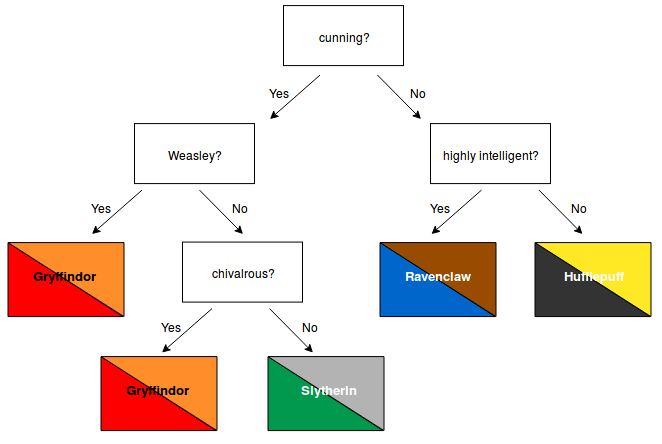

# 2. Classification

## Have you encountered a classification problem in your own research? 

## How did you solve it?

## Well, how exactly? 

**Basic illustration of different classfication methods:[sklearn notebook](2_0_classifier_comparison_sklearn.ipynb)**

## 2.1 Some terminology

Most terms have been introduced by Xavi and Mario yesterday:

* labels
* features
* categories

* error rate
* classification loss (function)
* misclassification risk

* true & false positives, true & false negatives
* confusion matrix
* completeness
* contamination 
* ...

To sort these out, 
**Let's have a look at the [astroML notebook](2_1_classification_astroML.ipynb)**

If you want more details, [here is the relevant book chapter](Material/Ivezic2020_09_classification.pdf). (Note that the book introduces classification as a special case of regression: "Classification is simply the analog of regression where y is categorical, for example $y = {0, 1}$").

[Here](Material/Anders2014_classification_poster.pdf) is an example of how these codes can be adapted for a real-life astro problem (from the 1st year of my PhD, 10 years ago:)

## 2.2 GROUP TASK! Dive into one (class of) algorithms:

* **Get together into 4 (heterogeneous:) groups**
* 

### Tree-based algorithms

Now that we have seen a couple of the typical classification methods, **Let's have a look at another important class of models: [Decision trees](2_2_decision_tree_classification.ipynb)** 
The theory is explained in Sect. 9.7 of the astroML book. If you prefer a short explanatory video, try for example [this](https://www.youtube.com/watch?v=JcI5E2Ng6r4). 

Now, we already know that random-forest algorithms usually perform better than decision trees. 
(WHY?)

So let's try them out.

### Neural networks

The [basics](https://github.com/zingale/computational_astrophysics/blob/main/content/machine-learning/neural-net-basics.md) of how an ANN works have been introduced by Emily in the morning. 

When we say "neural networks" or "ANNs", we usually mean [multi-layer perceptrons (MLPs)](https://scikit-learn.org/stable/modules/neural_networks_supervised.html#multi-layer-perceptron).

[Here](https://github.com/zingale/computational_astrophysics/blob/main/content/machine-learning/neural-net-mnist.ipynb) is anexample of a very simple ANN (coded from scratch) to classify hand-written digits.

[Here](https://github.com/zingale/computational_astrophysics/blob/main/content/machine-learning/keras-mnist.ipynb) is more complex neural network to do the same task - better (constructed with keras - see also the [afternoon session](04_convolutional_neural_networks.md)).

