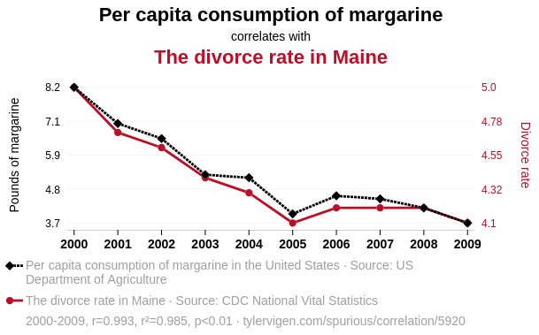

# 3. Regression

## Have you encountered a regression problem in your own research? 

## How did you solve it?

## 3.1 A typical data-science example

[Predicting salary](https://github.com/Pranjali1049/Salary_Prediction/blob/main/Salary%20Prediction.ipynb), house prices, credit worthiness, etc... 

### The zoo of regression models

There is an icredible variety of regressiion models on the market - to get an overview, let's just go through the [sklearn page](https://scikit-learn.org/stable/supervised_learning.html).

Again, for a more focused view on (now mostly non-ML) regression methods, have a look at [the relevant astroML book chapter](Material/Ivezic2020_08_regression.pdf). Remember: **if you can write down a physically motivated model, use it**. Not always is there a need for ML.

## 3.2 An astrophysics example: photometric redshifts

[Tree-based regression models for photometric redshifts](3_1_photo_z_regression.ipynb)

## 3.3 A more detailed example (with TASKS:)

[XGBoost for estimating stellar ages from spectroscopic data](3_2_train_xgboost_apogee_ages.ipynb)

This example at least touches also the following points:

### 3.3.1 Including uncertainties in ML models

[Here](https://github.com/henrysky/astroNN/blob/master/demo_tutorial/NN_uncertainty_analysis/Uncertainty_Demo_x_sinx.ipynb) is a nice short tutorial of how to do this for different techniques.

[This notebook](https://www.kaggle.com/code/neerajmohan/monte-carlo-dropout-uncertainity-prediction-in-dnn) focusses on the Mote-Carlo droput technique often used for neural networks. 

### 3.3.2 Making ML models interpretable 

Again, there is a zoo of methods that can help you interpreting your (sometimes seemingly black-box) ML models.
A couple of years ago, a powerful method (with a powerful implementation) emerged: SHAP. 

